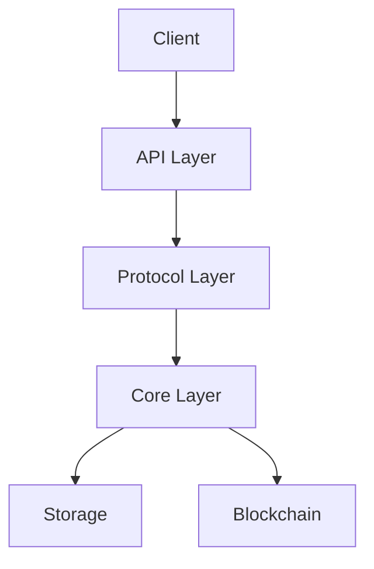
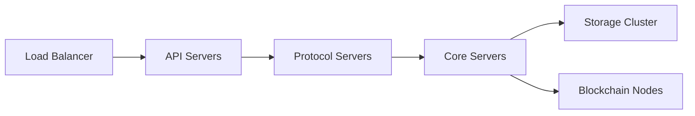

# Ethereum Lightning Network: Architecture and Reserve-Credit Model

## Overview and Core Innovations
This Lightning Network (LN) implementation for Ethereum represents a significant advancement in payment channel networks by introducing programmable functionality and flexible capacity management. The system combines off-chain scalability with the programmable capabilities of Ethereum smart contracts to enable sophisticated financial instruments and governance structures.

## Key Architectural Components

### 1. Programmable Subcontracts
The subcontract system enables complex payment conditions within payment channels, supporting various DeFi applications:

- Hash Time Locked Contracts (HTLCs) for atomic swaps and cross-chain transactions
- Credit Default Swaps with external triggers
- Programmable payment schedules and conditional payments
- Token swaps and liquidity provision within channels

The SubcontractProvider contract serves as both a registry and executor for these payment conditions, allowing new financial instruments to be added without modifying the core protocol.

### 2. Programmable Entities
The EntityProvider contract introduces sophisticated governance capabilities that allow channels to be controlled by complex organizational structures rather than simple private keys. This enables:

- Multi-signature control of channels
- DAO-like governance structures
- Delegated control and hierarchical permissions
- Dynamic voting thresholds and stakeholder structures

For example, a channel could be governed by a DAO where token holders vote on operations, or by a federated group with weighted voting rights.

### 3. Layered Architecture
The system implements a three-layer architecture:

1. Base Layer: Depository contract managing core payment channel mechanics
2. Programmability Layer: SubcontractProvider enabling custom payment conditions
3. Governance Layer: EntityProvider enabling programmable control

This structure maintains separation of concerns while enabling complex compositions of functionality.

## The Reserve-Credit Model

### Core Components
The system implements an innovative reserve-credit model that combines multiple balance components:

#### Reserves
- Tokens committed to the Depository contract
- Provide underlying security for channel operations
- Can be moved between channels as needed

#### Collateral
- Portion of reserves locked into specific channels
- Provides base capacity for making payments
- Directly backs payment obligations

#### Credit Limits
- Allow payments beyond collateral amounts
- Establish trust relationships between parties
- Similar to lines of credit in traditional finance

### Balance Calculation
The deriveDelta function calculates payment capacities using these key formulas:

```typescript
    // Calculate total net transfer in channel
    const delta = d.ondelta + d.offdelta;
    const collateral = nonNegative(d.collateral);
    // Calculate collateral distribution
    let inCollateral = delta > 0n ? nonNegative(collateral - delta) : collateral;
    let outCollateral = delta > 0n ? (delta > collateral ? collateral : delta) : 0n;
    // Calculate credit utilization
    let inOwnCredit = nonNegative(-delta);
    if (inOwnCredit > ownCreditLimit) inOwnCredit = ownCreditLimit;
    let outPeerCredit = nonNegative(delta - collateral);
    if (outPeerCredit > peerCreditLimit) outPeerCredit = peerCreditLimit;
```


### Payment Flow
Payments follow a waterfall structure:

1. First utilize available collateral
2. Then consume credit limit if needed
3. Total capacity = collateral + available credit

This creates bidirectional payment channels with:

- Forward Capacity = user's collateral + counterparty's credit limit
- Backward Capacity = counterparty's collateral + user's credit limit
- Dynamic rebalancing as payments flow

### State Visualization
The system includes an innovative ASCII visualization showing:

```
[-------------------====================--------------------]
     Credit Limit       Collateral        Credit Limit
                           |
                     Current Balance
```


This helps users understand:
- Balance position relative to total capacity
- Available collateral and its utilization
- Credit limits in both directions
- Overall channel state

## Benefits and Applications
The combination of programmable contracts and the reserve-credit model provides several key advantages:

### Scalability
- Moves most transactions off-chain
- Maintains security through eventual settlement
- Efficient capacity utilization

### Programmability
- Complex financial instruments within channels
- DeFi functionality without on-chain transactions
- Extensible contract system

### Flexibility
- Dynamic capacity through credit limits
- Complex organizational control structures
- Adaptable trust relationships

### Security
- Collateral-backed payments
- Programmable governance
- Clear separation of concerns

This architecture provides a foundation for building sophisticated financial applications that combine the scalability benefits of payment channels with the programmability of Ethereum smart contracts. It's particularly well-suited for DeFi applications requiring high throughput while maintaining complex payment conditions and governance structures.

The careful balance between on-chain and off-chain execution, combined with the flexible reserve-credit model, creates a powerful platform for next-generation decentralized financial applications.


Repo structure:

```
packages/contracts/ — smart contracts
packages/node/ — xln node implementation
packages/types/ — typescript types
packages/webapp/ — webapp implementation
packages/devtools/ — devtools for running and testing smart contracts
docs/ — documentation
```


# Core Components Documentation

## Overview

The system is built around several core components that work together to provide secure, efficient payment channel functionality. This document details these components and their interactions.

## Channel

The `Channel` class is the primary component that manages the payment channel state and operations.

### Key Features

- State management using HSTM (Hierarchical State-Time Machine)
- Merkle tree-based state verification
- Support for atomic swaps and conditional payments
- Subchannel management for different tokens/chains

### State Structure

```typescript
interface IChannelState {
  channelId: string;
  left: string;
  right: string;
  nonce: number;
  subchannels: { [key: string]: ISubchannel };
  signatures: ISignature[];
  merkleRoot?: string;
  blockId?: number;
}
```

### Key Methods

- `initialize()`: Sets up the channel with initial state
- `openSubchannel()`: Creates a new subchannel for token transfers
- `updateBalance()`: Updates subchannel balances
- `signState()`: Signs the current channel state
- `applyBlock()`: Applies a block of transitions to the channel

## Block

Blocks are used to batch multiple state transitions together for efficient processing.

### Structure

```typescript
interface IBlock {
  blockId: number;
  isLeft: boolean;
  timestamp: number;
  transitions: ITransition[];
}
```

### Usage

- Groups related transitions together
- Provides atomic execution of multiple state changes
- Enables efficient state synchronization between participants

## HSTM (Hierarchical State-Time Machine)

The HSTM component provides reliable state management with temporal tracking.

### Key Components

- `IStorageService`: Interface for persistent storage
- `ISnap`: Interface for state snapshots
- `ISTM`: Interface for the state machine instance

### Features

- Persistent state storage
- State transition validation
- Temporal state tracking
- Efficient caching mechanism

## Merkle Tree

The Merkle tree implementation provides efficient state verification and proof generation.

### Features

- Configurable hash algorithm
- Batch processing support
- Proof generation and verification
- Efficient storage mechanism

### Usage

```typescript
const merkleTree = createMerkleTree({
  batchSize: 16,
  hashAlgorithm: 'sha256'
});

// Build tree from values
merkleTree.build(values);

// Generate proof
const proof = merkleTree.getProof(value);

// Verify proof
const isValid = merkleTree.verify(value, proof);
```

## Transitions

Transitions represent state changes in the channel.

### Types

- Payment transitions
- Swap transitions
- Subchannel transitions
- Dispute resolution transitions

### Structure

```typescript
interface ITransition {
  type: TransitionType;
  timestamp: number;
  blockNumber: number;
  apply(channel: Channel): Promise<void>;
  verify(channel: Channel): Promise<boolean>;
}
```

## Storage

The system uses LevelDB for persistent storage with a flexible interface.

### Features

- Key-value storage
- Binary data support
- Atomic operations
- Error handling

### Usage

```typescript
const storage = new LevelStorageService('./db-path');

// Store data
await storage.put(key, value);

// Retrieve data
const value = await storage.get(key);

// Delete data
await storage.delete(key);
```

## Error Handling

The system includes specialized error classes for different components:

- `ChannelError`: Channel-related errors
- `MerkleError`: Merkle tree operation errors
- `HSTMError`: State machine errors

### Example

```typescript
try {
  await channel.applyTransition(transition);
} catch (error) {
  if (error instanceof ChannelError) {
    // Handle channel-specific error
  } else if (error instanceof MerkleError) {
    // Handle Merkle tree error
  } else {
    // Handle other errors
  }
}
```

## Best Practices

1. **State Management**
   - Always use atomic operations for state changes
   - Validate state transitions before applying
   - Maintain proper state synchronization between participants

2. **Error Handling**
   - Use appropriate error types
   - Provide detailed error messages
   - Implement proper error recovery

3. **Performance**
   - Use batching for multiple transitions
   - Implement efficient caching
   - Optimize Merkle tree operations

4. **Security**
   - Validate all state transitions
   - Verify signatures and proofs
   - Implement proper access control 


# System Architecture

## Overview

The system implements a state channel network with support for multi-token transfers, atomic swaps, and conditional payments. It follows a modular architecture with clear separation of concerns and well-defined interfaces between components.

## Architecture Layers

### 1. Core Layer

The foundation of the system, implementing core payment channel functionality:

- Channel state management
- State transitions
- Merkle tree verification
- Persistent storage

Key Components:
- `Channel`: Main channel management
- `HSTM`: State machine implementation
- `MerkleTree`: State verification
- `LevelStorageService`: Persistent storage

### 2. Protocol Layer

Implements the communication protocol between channel participants:

- Message serialization/deserialization
- State synchronization
- Block processing
- Signature verification

Components:
- `Transport`: Network communication
- `MessageProcessor`: Protocol message handling
- `StateSync`: State synchronization
- `SignatureVerifier`: Cryptographic verification

### 3. API Layer

Provides external interfaces for interacting with the system:

- REST API for channel management
- WebSocket API for real-time updates
- JSON-RPC API for blockchain interaction

Components:
- `APIServer`: HTTP/WebSocket server
- `RouteHandler`: API endpoint handling
- `WebSocketManager`: Real-time communication
- `BlockchainClient`: Chain interaction

## Component Interactions



### Data Flow

1. Client initiates action via API
2. API layer validates request
3. Protocol layer processes message
4. Core layer executes state transition
5. State changes are persisted
6. Response flows back to client

## State Management

### Channel State

- Hierarchical state structure
- Merkle-based verification
- Temporal state tracking
- Atomic state transitions

### State Synchronization

1. Block Creation
   - Group transitions
   - Verify validity
   - Create Merkle proof

2. Block Processing
   - Verify signatures
   - Apply transitions
   - Update state
   - Generate proofs

3. State Verification
   - Merkle proof verification
   - Signature validation
   - State consistency checks

## Security Architecture

### Cryptographic Security

- Elliptic curve signatures
- Hash-based commitments
- Merkle tree verification
- Secure key storage

### Network Security

- TLS encryption
- Message authentication
- Rate limiting
- DDoS protection

### State Security

- Atomic state updates
- Double-spend prevention
- Timeout handling
- Dispute resolution

## Scalability Design

### Horizontal Scaling

- Stateless API servers
- Distributed state storage
- Load balancing
- Connection pooling

### Performance Optimization

- State caching
- Batch processing
- Efficient proofs
- Optimized storage

## Deployment Architecture

### Components



### Infrastructure Requirements

1. **Compute Resources**
   - API servers: 2+ cores, 4GB+ RAM
   - Core servers: 4+ cores, 8GB+ RAM
   - Protocol servers: 2+ cores, 4GB+ RAM

2. **Storage Requirements**
   - Channel state: SSD storage
   - Transaction history: Scalable storage
   - Merkle trees: In-memory/SSD

3. **Network Requirements**
   - Low latency connections
   - High bandwidth capacity
   - Redundant networking

## Error Handling Architecture

### Error Types

1. **Application Errors**
   - Channel errors
   - State errors
   - Protocol errors

2. **System Errors**
   - Network errors
   - Storage errors
   - Resource errors

3. **Security Errors**
   - Authentication errors
   - Authorization errors
   - Cryptographic errors

### Error Recovery

1. **State Recovery**
   - State rollback
   - State reconciliation
   - Automatic retry

2. **Connection Recovery**
   - Automatic reconnection
   - Session recovery
   - State resynchronization

## Monitoring Architecture

### Metrics Collection

- Performance metrics
- State metrics
- Error metrics
- Network metrics

### Alerting

- Error rate alerts
- Performance alerts
- Security alerts
- Resource alerts

### Logging

- Application logs
- Error logs
- Security logs
- Audit logs

## Development Architecture

### Code Organization

```
src/
├── core/         # Core components
├── protocol/     # Protocol implementation
├── api/          # API endpoints
├── utils/        # Utilities
├── types/        # Type definitions
└── test/         # Test suites
```

### Development Workflow

1. **Code Changes**
   - Feature branches
   - Code review
   - Automated testing
   - CI/CD pipeline

2. **Testing Strategy**
   - Unit tests
   - Integration tests
   - Performance tests
   - Security tests

3. **Deployment Process**
   - Automated builds
   - Staging deployment
   - Production deployment
   - Monitoring 